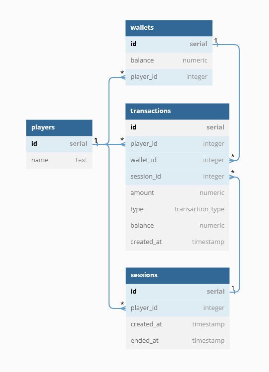

# Player Wallet App

Backend wallet application for storing balances and allowing bets and wins inside play sessions.

## Prerequisites

PostgreSQL on your local machine or a remote PostgreSQL server.

## Installation

To install the application, follow these steps:

1. Clone the repository: `git clone https://github.com/Gituar/player-wallet-app.git`
2. Install dependencies: `npm install`
3. Create a new database for example: `createdb player_wallet_app`
4. Run `psql -d player_wallet_app -f src/db/create.sql`
5. Set up environment variables: Create a `.env` file based on the `.env.example` file and replace the values with your own.
6. To seed your database with initial data for testing or development purposes run `psql -d player_wallet_app -f src/db/init.sql`, replacing `player_wallet_app` with the actual name of your database from `.env` file.
7. To build the project run `npm run build`
8. You can run tests with `npm test`

## Usage

Start the application: `npm start`

The application exposes the following endpoints:

- `POST /players/:playerId/wallet`: Create a new wallet for a player.
- `GET /players/:playerId/wallet`: Get the wallet of a player.
- `POST /players/:playerId/sessions`: Create a new play session for a player.
- `GET /players/:playerId/sessions`: Get all play sessions for a player.
- `POST /players/:playerId/sessions/:sessionId/withdrawals`: Make a withdrawal or bet transaction within a session.
- `POST /players/:playerId/sessions/:sessionId/deposits`: Make a deposit or win transaction within a play session.
- `GET /players/:playerId/sessions/:sessionId/transactions`: Retrieve all transactions for a player in a play session.

[API Documentation](https://gituar.github.io/player-wallet-app/swagger-ui)

## Database schema

## Contributing

If you would like to contribute, please fork the repository and create a pull request. Please ensure that your code adheres to the observables specified in the requirements and has appropriate test coverage.

## License

This project is licensed under the MIT License - see the [LICENSE](LICENSE) file for details.

## Acknowledgments

This project was created as part of a job pre-hire assessment.